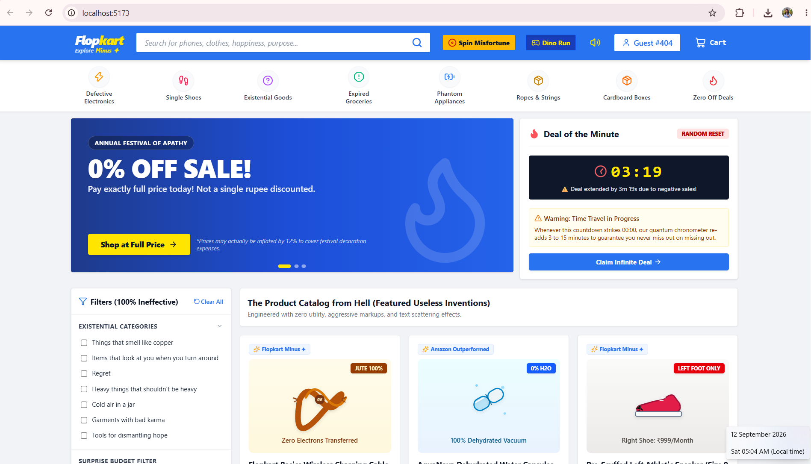
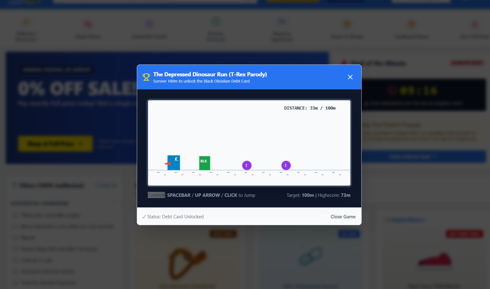
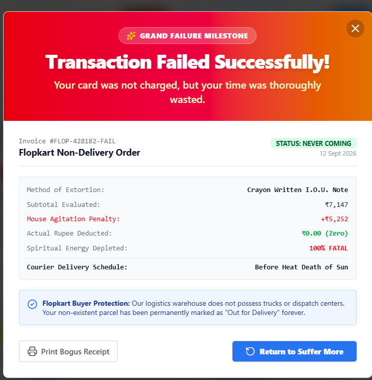

# Flopkart: Explore Minus ✦ 🛒🎯

A complete, fully functioning satirical e-commerce web platform engineered to look like a premier Indian shopping destination (Flipkart), but deliberately weaponized to be 100% useless, annoying, and absurd.

---

## Basic Details
### Team Name: USELESS

### Team Members
- Team Lead: Akash K A - Government Engineering College Thrissur
- Member 2: Sreenanda S - Government Engineering College Thrissur

### Project Description
Flopkart is a satirical parody of major e-commerce platform Flipkart where every single feature—from search and cart checkout to authentication and customer support—has been engineered for maximum frustration, spiritual exhaustion,ragebait and comedic futility. You can only log in by physically looking away from your monitor, and whatever you search for, the algorithm only gives you a slightly damp cardboard box.

### The Problem (that doesn't exist)
Modern e-commerce platforms like Amazon and Flipkart are tragically functional. Users find products too easily, discounts actually save people money, delivery is reliably fast, and customer service is overly polite. Consumers are losing their resilience, patience, and ability to handle everyday disappointment. Society is suffering from an acute shortage of unmitigated online retail despair.

### The Solution (that nobody asked for)
Flopkart restores character-building agony through cutting-edge anti-UX engineering:
- **Quantum "Look Away" Authentication**: Senses user observation via webcam AI head-tracking or window blur. If you look at the screen, authentication freezes at 0%. You must look away or close your eyes to sign in.
- **Persistently Trolling Product Discovery**: No matter what query you search for (*"iPhone 16"*, *"running shoes"*, *"happiness"*), search unconditionally returns *"A Slightly Damp Cardboard Box (Pre-Crushed, 87% moisture)"*.
- **The Catalog from Hell**: 7 absurd products including a *Wireless Charging Cable* made of coarse rope (0m length), *Dehydrated Water Capsules* (add 200ml water to make 200ml water), a *Pre-Scuffed Left Shoe* (right shoe sold via monthly subscription), and a *Plastic Mystery Button* with 0.00mm travel.
- **The Depressed Dinosaur Run Mini-Game**: Built-in 2D runner game where jumping over floating Excel sheets, Slack pings, and wet cardboard boxes for 100m unlocks the mythical, pre-maxed *Black Obsidian Debt Card*.
- **Live Mouse Velocity "Panic Surcharge"**: Moving your cursor rapidly inside the cart dynamically ratchets up your order total in real-time.
- **30% Cart Escape Chance & Dodging Buttons**: Items have a 30% chance of fleeing the cart when clicked, and the "Proceed to Checkout" button physically hops away 3 times before letting you click it.
- **Thematic Sound Synthesizer**: Clicking "Defective Electronics" sparks and zaps, "Expired Groceries" makes a nauseating wet squelch, and "Zero Off Deals" plays a 4-note sad trombone.
- **Babloo - Hostile Anti-Customer Support**: An AI chat executive who refuses to help and insults your life choices.
- **Insecure Payment Gateway**: Accepts Monopoly money, a crayon-drawn I.O.U. note, or a 2-second firm handshake, culminating in a fireworks explosion celebrating: *"Transaction Failed Successfully! Your card was not charged, but your time was thoroughly wasted."*

---

## Technical Details

### Technologies/Components Used
For Software:
- **Languages used**: TypeScript, JavaScript, HTML5, CSS3
- **Frameworks used**: React 19, Tailwind CSS v4, Vite 8
- **Libraries used**: 
  - `lucide-react` (icons)
  - `canvas-confetti` (full-screen particle fireworks)
  - `Web Audio API` (100% procedural sound synthesizer for electrical zaps, squelches, sad trombone, and fanfare)
  - `MediaDevices WebRTC API` (AI webcam head & gaze tracker)
- **Tools used**: Visual Studio Code, Git, npm, modern browsers

---

### Implementation
For Software:

# Installation
```bash
# Clone the repository
git clone https://github.com/akashka755/useless_project.git

# Navigate into the project folder
cd useless_projects

# Install dependencies
npm install
```

# Run
```bash
# Start the development server with local and network host exposure
npm run dev

### Project Documentation
For Software:

# Screenshots

*The Chaotic Flopkart Homepage featuring the signature corporate blue banner advertising "0% Off Sale! Pay full price today!" and the runaway "Deal of the Minute" countdown timer.*


*The Quantum Authentication modal featuring an unblinking eye and AI Webcam head tracker that locks authentication at 0% whenever the user looks at their screen.*


*The playable 2D HTML5 canvas runner game where players jump over Excel spreadsheets and Slack pings to unlock the Black Obsidian Debt Card.*


*The Aggravating Cart with a real-time mouse speed odometer dynamically inflating the bill and an evading "Proceed to Checkout" button dodging the cursor.*


*The Insecure Payment Gateway with interactive Crayon I.O.U. canvas, culminating in full-screen fireworks and a printable bogus invoice.*

# Diagrams
```
┌─────────────────────────────────────────────────────────────┐
│                 USER BROWSING / SEARCH                     │
└──────────────────────────────┬──────────────────────────────┘
                               │
            ┌──────────────────┴──────────────────┐
            ▼                                     ▼
   [ Search for Any Item ]               [ Click "Sign In" ]
   No matter the query:                  Must look away from screen!
   Algorithm returns ONLY                Camera / Sensor tracks gaze:
   "A Slightly Damp Cardboard Box"       100% when UN-OBSERVED
            │                                     │
            └──────────────────┬──────────────────┘
                               ▼
                    [ Add Item to Cart ]
                    • 30% chance item escapes!
                    • Text scatters and scrambles
                               │
                               ▼
                    [ Open Cart Drawer ]
                    • Cursor speed tracked in px/s
                    • "Panic Surcharge" inflates total
                    • "Proceed" button dodges 3 times
                               │
                               ▼
                    [ Useless Payment ]
                    • Monopoly Money
                    • Crayon I.O.U. Canvas
                    • 2-Second Firm Handshake
                               │
                               ▼
         [ Transaction Failed Successfully! 🎆 ]
         • Full-screen celebratory fireworks
         • Printable Bogus Tax Invoice #FLOP-FAIL
```
*Complete Anti-UX User Journey Architecture of Flopkart.*

---

### Project Demo
# Video
[View Project Video on Google Drive]([https://drive.google.com/drive/folders/YOUR_FOLDER_ID](https://drive.google.com/drive/folders/1A15k4J81IfGvMP_6kyt2_AdFxEkw7_By?usp=sharing))

*A walkthrough showcasing the Quantum look-away login, the 30% cart escape probability, the mouse panic surcharge, the Dinosaur runner game, and the crayon payment checkout.*

# Additional Demos
- Live local host: `http://localhost:5173/`
- Network Wi-Fi host: `http://10.244.46.71:5173/`

---

## Team Contributions
- **Team Lead**: Architecture, Quantum Look-Away AI Head Tracker, Cart Mouse Velocity Surcharges,Checkout Evasion mechanics,Existential Dread Captcha, and Babloo Anti-Customer Support Chatbot.
- **Member 2**: The Depressed Dinosaur Runner 2D Canvas mini-game, Web Audio API procedural sound synthesizers (zaps, squelches, sad trombone),Satirical product mockups, SVG artwork.
- **Member 3**:

---
Made with ❤️ at TinkerHub Useless Projects 


